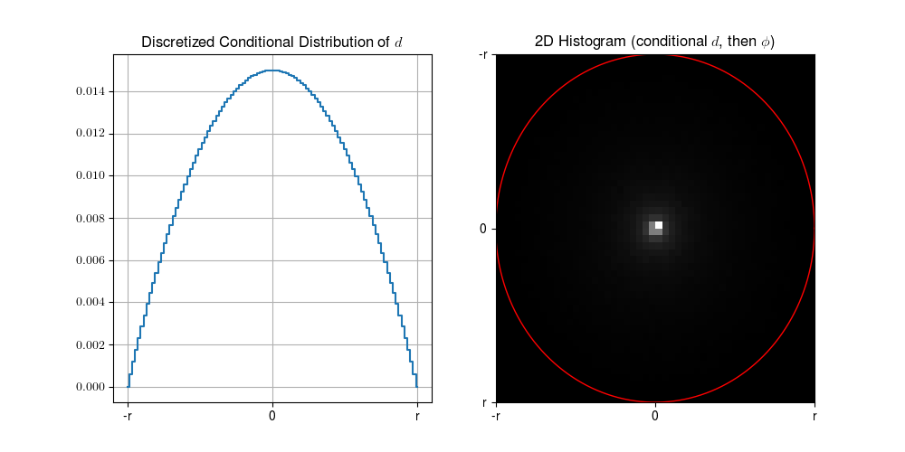

# About Bullet Trajectories for Phoenix Point

Hi all, I am a researcher in Artificial Intelligence, and as a child I grew up with some of the games by [Julian Gollop](https://en.wikipedia.org/wiki/Julian_Gollop), such as "UFO: Enemy Unknown" (better known as "X-COM: Enemy Unknown") and its "Terror from the deep" sequel. When I found out that he had a new, similar, game in the works and that he was running a crowdfunding campaign I knew I was going to back it (and that I did, immediately). That game is [Phoenix Point](https://phoenixpoint.info) and it is shaping up rather nicely.

One of the cool game features that a tactical geek may like is that bullet trajectories are actually simulated via a simplified, but realistic, ballistic system. The player can aim freely, and the HUD displays two circles: all shots are guaranteed to land within an external red circle, and shots have a 50% chance to land within an inner yellow circle. The way the trajectory were generated in a recent pre-alpha build (released to the backers) sparked some debate about how such trajectories should be generated ([you can search a bit on the forums](https://forums.snapshotgames.com/c/phoenix-point/game-feedback)).

Some of the debate focused on a few observations about the use of a bell curve, with _peaks on the yellow circle_. That got me both perplexed (because intuitively shots should mostly go to the middle, not in a ring) and interested (because outer rings are wider, and so they should be the landing place of more shots).

The real problem, however, is that [this happened](https://xkcd.com/356/).

You see, dealing with probabilities is part of what I do in my job, and this kind of conundrum was to sweet a lure to let it pass. Result: I _may_ have got sucked in juuust a bit too much... Luckily, however, after some thinking and tinkering I may have some nice practical and theoretical results, and hence I am sharing (something I seldom do).

For those who are already bored:

* Yes, shots should have a higher probability to land in the middle...
* ...But if you want to achieve that, you need to make use of a strange probability distribution with a bell curve as the one described by the developers
* The nice part is that, if everything is done right, _you can get perfectly controllable results_. This is where I hope I may be saying something new.

You still with me? Good: brace yourself for some math.

## Reference System

Let's say a shooter is at distance $l$ from the target. Bullets are shot with some dispersion angle $\theta$ from the aiming point, but I will actually do all my reasoning on the target plane. Hence:

* The maximum spread can be specified via some radius $r$
* The $\theta$ angle translates into a distance $d$ from the center
* The bullet landing place is identified by $\theta$, plus a rotational angle $\phi$

Some more details:

* I am using the diameter to measure the distance, so I may have both positive and negative $d$. In general, $d$ is in the interval $[-r, r]$
* I am using radiants to measure angles. Combine this with the previous statement and you get that $\phi$ is in the interval $[0, \pi]$ (0 to 180 degrees)

All considerations can be done in terms of the dispersion angle $\theta$ as well, but there are some minor resulting differences.

## The Joy of the Beta Distribution

We'll definitely need a Bell curve at some point. The usual suspect in this cases is of course the [Normal distribution](https://en.wikipedia.org/wiki/Normal_distribution), but that's a false friend for us. The reason is that we are reasoning with bounded spread (everything should land in the red circle, right?), but the Normal distribution has infinite support (i.e. ranges over $]-\infty, +\infty[$).

And so we come to a personal favorite of mine: the [Beta distribution](https://en.wikipedia.org/wiki/Beta_distribution). A beta distribution ranges over an arbitrary bounded interval $[a, b]$, which makes it perfect for our red circle. It can also take a huge variety of shapes, controlled by two parameters usually called $\alpha$ and $\beta$.

We will need curves (probability distributions) to model the probability of the spreading distance $d$, and they will need to be:

* Symmetric (unless we want to start modeling recoil effects, but that is probably too much)
* Have their mean in 0 (the aiming point)
* Get smaller the closer we get to the red circle, i.e. toward the edges of the diameter

In mathematical terms, this means we want $\alpha = \beta > 1$. By choosing an actual value for the two, we can determine how Bell-shaped and spread out the curve is. Generally:

* Lower $\alpha$ and $\beta$ result in flatter shapes ($\alpha = \beta = 1$ is perfectly flat)
* Higher $\alpha$ and $\beta$ result in more bell-shaped curves.

You can see a couple of examples here:

Geek note: technically these are Probability Density Functions (PDFs), not probability. That's why a value on the $x$ axis can have a density higher than 1 (true probabilities cannot be larger than 1). That's fine, however: the only requirement is that densities are positive and the total area under the curve is 1. Long story short: it's the shape of the curve that matters, rather than its values.

## The Goal and the Model

Ok, now let's describe what we are aiming at (sorry for the pun). First, _we'd like the probability of each landing point to grow as we get closer to the aiming point_ (the center of the red circle). In practice, this means we would get to have a probability map similar to the left-most plot in this figure (brighter points in the image correspond to higher probabilities):

Second, _we'd like to precisely control the shape of the probability distribution along a section_ (right-most plot in the figure). For this, we can use a beta distribution, so that I can easily control the spread. The higher the "aim" stat of the shooter, the less spread out the probability distribution should be, and with a beta distribution this means that higher aim translates to higher $\alpha$ and $\beta$. Just for record: in the example I am assuming a low-ish aim ($\alpha = \beta = 2$, it's one of the two shapes from the previous figure).

In probability theory terms:

* The landing place of each bullet is determined by two random variables, namely $d$ and $\phi$
* The left-most plot represents the Joint Probability Density Function $f(d, \phi)$
* We are assuming that the conditional PDF of $d$ (i.e. $f(d \mid \phi)$) is given by a beta distribution. In laymen words, once $\phi$ is fixed, then $d$ follows a beta distribution
* We are assuming that the conditional PDF of $\phi$ (i.e. $f(\phi \mid d)$) is given by a uniform distribution over the length of the corresponding semi-circle, i.e. the density of each point is $\frac{1}/{\pi d}$

This allows us to obtain the desired probability density over the circle and to control the effect of aim.

## Pitfalls of Straightforward sampling

The trouble start when we begin to think about how to actually choose the trajectory for a single bullet, so that it follows the desired probability distribution, i.e. when we need to sample our distribution.

Actually sampling from the joint PDF (i.e. from our shaded circle) it's a bit tricky. It's much easier instead to sample one variable at a time, e.g. $d$ and then $\phi$.

The naive thing to do would be to sample from the PDF of a section to obtain a value for $\phi$, and then sampling $\phi$ uniformly over the half-circle with length $\pi d$.

Unfortunately, this does not work. If we do it, we get the results from the following figure:

On the left we have a discretized version of the conditional distribution of $d$. "Discretized" means that this time we have a finite set of possible $d$ values, each with a well defined (true) probability attached. On the right we have the 2-D histogram after sampling 520,200 points. This is not at all our original plot!

## Formally Correct Sampling

What did go wrong? The trick is that we only know the _conditional_ distributions of $d$ and $\phi$ (i.e. beta and uniform distributions). Hence, we cannot start by sampling our conditional $d$! We can only do it once we know $\phi$. So:

* We cannot sample from $f(d \mid \phi)$ until we know $\phi$
* We cannot sample from $f(\phi \mid d)$ until we know $d$

Hence, we have the classical chicken and egg problem. How do we solve it? We can use _marginalization_ to turn a conditional distribution into a "normal" one. In particular, we can:

* Consider a discretization $D$ of $d$, i.e. a finite set of possible distance values
* Obtain a weight for each $d$ value by summing $f(d \mid \phi)$ over all the possible values of $\phi$.
* Normalize the result by dividing over the sum of all the computed weights (so that the sum becomes 1, and we have a probability distribution for $d$)

Since $\phi$ is uniformly distributed, this means we have:

$$P(d) = \frac{\pi |d| B(d)}{\sum_{d \in D} \pi |d| B(d)}$$

Where:

* $B(d)$ is the density of our beta distribution for $d$
* $\pi |d|$ is the length of the half-circle with radius $|d|$
* $D$ is our discretization

Note that, due to the discretization, this time we are obtaining actual probabilities rather than densities. The shape of the resulting probability distribution is shown in the following figure, together with the results of sampling $d$ according to our new probabilities $P(d)$.

And now we got it right, and we have the strange double-bell curve mentioned by the devs. So, the devs are right! But also those who where puzzled by the original statement are right. To be precise:

* In terms of the joint PDF, the highest probabilities should go _in the center_
* But if we want to achieve that by sampling first $d$ and than $\phi$, we need to use a probability distribution that has indeed a roughly double-bell shape
* The radius of the yellow circle can be computed by finding the (approximate) 25-th and 75-th percentile of the marginalized distribution

And now I'll get a bit picky: if you pay careful attention, you will notice that the double-bell curve is not a true double-bell. The peak does not necessarily match the radius of the yellow circle (it may be a bit off), and the two sides of the distribution are not symmetric around each peak.

Instead, the shape is exactly the one required to obtain our original, desired, joint PDF (the original shaded circle). Indeed, using two individual symmetric bell curves (e.g. two beta distributions, or two truncated Normal distributions) would not achieve this result.

That's all. I took longer than I expected! It was a nice exercise, though. Plus, hey, nobody forced you to read :-)

I may have re-invented the wheel (I certainly did, from a statistical standpoint). I don't know what the developers are actually using under the hood: it would make me a bit proud to have given at least a small contribution :-).

BTW: the python code to build all the figures is included in this repository.
